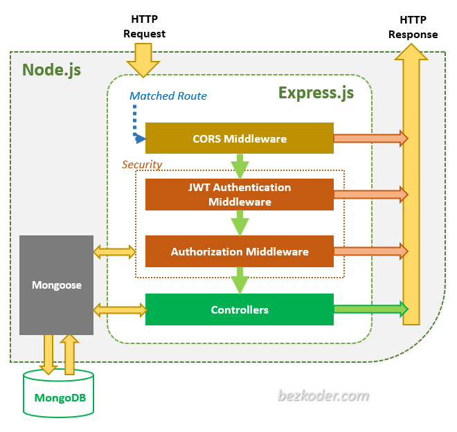
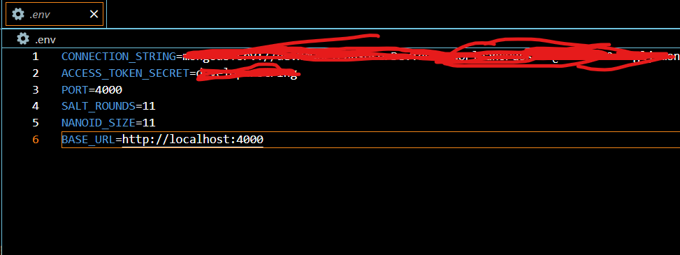
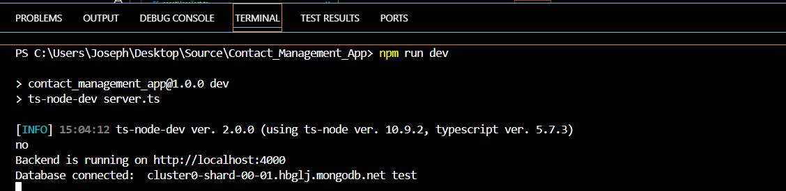
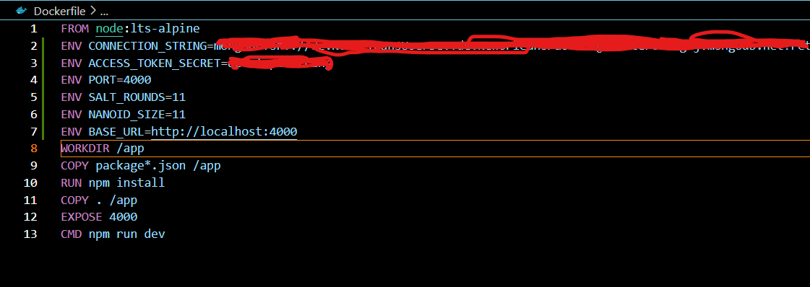
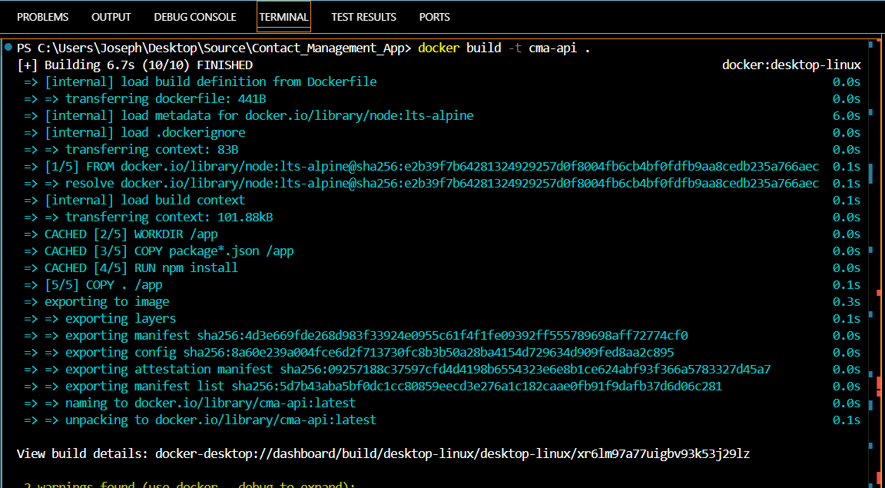
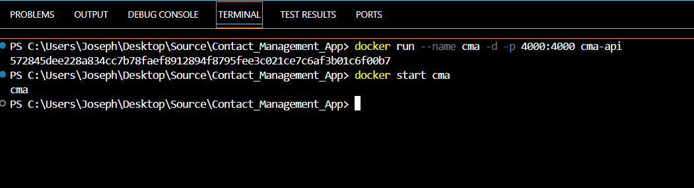
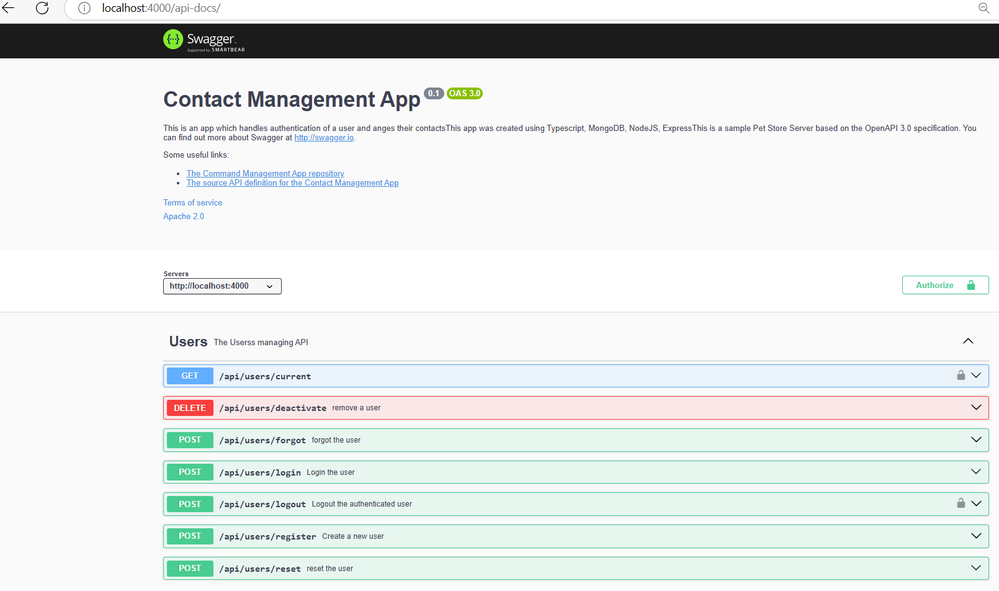

# **System Design Document (SDD)**  
## **Contact Management App**  
**Version:** 1.1
**Date:** January 22, 2025

---

## Description
This is a Backend Application (Express + Node + Mongoose) which stores user information and contacts.


## Authors

- [@jadogeri](https://www.github.com/jadogeri)

## Screenshots

|         |  |
| --------------------------------------- | --------------------------------------- |
|  |                                         |
         |  |
| --------------------------------------- | --------------------------------------- |
|  |                                         |
## Table of Contents

   <ul>
      <li><a href="#1-introduction">1. Introduction</a>
        <ul>
          <li><a href="#11-purpose">1.1 Purpose</a> </li>
          <li><a href="#12-scope">1.2 Scope</a> </li>
          <li><a href="#13-intended-audience">1.3 Intended Audience</a> </li>
        </ul>
      </li>
    </ul>
    <ul>
      <li><a href="#2-api-reference">2. API Reference</a>
      </li>
    </ul>
    <ul>
      <li><a href="#3-system-architecture">3. System Architecture</a>
        <ul>
          <li><a href="#31-high-level-architecture">3.1 High Level Architecture</a> </li>
          <li><a href="#32-technology-stack">3.2 Technology Stack</a> </li>
          <li><a href="#33-deployment-artifacts">3.3 Deployment Artifacts</a> </li>
        </ul>
      </li>
    </ul>
    <ul>
      <li><a href="#4-data-design">4. Data Design</a>
        <ul>
          <li><a href="#41-data-entities-and-relationships">4.1 Entities and Relationships</a> </li>
          <li><a href="#42-database-conceptual-schema">4.2 Database Conceptual Schema</a> </li>
          <li><a href="#33-deployment-artifacts">3.3 Deployment Artifacts</a> </li>
        </ul>
      </li>
    </ul> 
    <ul>
      <li><a href="#5-installation">5. Installation</a>
      </li>
    </ul> 
    <ul>
        <li><a href="#6-usage">6. Usage</a>
        <ul>
            <li><a href="#61-run-application">6.1 Run Application</a> </li>
            <ul>
              <li><a href="#611-run-locally">6.1.1 Run Locally</a> </li>
              <li><a href="#612-run-docker-container">6.1.2 Run Docker Container</a> </li>
            </ul>
        </ul>
        </li>
    </ul> 
    <ul>
        <li><a href="#7-tests">7. Tests</a>
        </li>
    </ul>    
    <ul>    
        <li><a href="#8-license">8. License</a>
        </li>
    </ul> 
    <ul> 
        <li><a href="#9-references">9. References</a>
        </li>
    <ul>
    

## **1. Introduction**  
### **1.1 Purpose**  
This document outlines the system architecture, components, and design considerations for Contact Management App. The goal is to provide a template for backend developers to handle CRUD operations and authentication flow.

### **1.2 Scope**  
The system will allow users to:  
- Submit personal property declarations online.  
- Integrate seamlessly with the parish tax collection system for calculations and payments.  

### **1.3 Intended Audience**  
- End Users (Individuals and Businesses)  
- Junior or Senior backend developers.

---

## **2. API Reference**  
* [Link to Documentation ](https://documenter.getpostman.com/view/40822092/2sAYQdkAQe#8e614d40-ca8d-4038-95ed-66c932ce2d5e)


## **3. System Architecture**  
### **3.1 High-Level Architecture**  
The system follows a **three-tier architecture**:  
1. **Presentation Layer**: This layer directly interacts with incoming HTTP requests, defines routes using Express's routing mechanism, and sends back the final response to the client.   
2. **Application Layer**: This layer encapsulates the core business logic, performing operations like data validation, calculations, and complex data manipulation, typically called by the route handlers in the presentation layer. 
3. **Data Layer**: This layer handles communication with the database, performing CRUD operations to retrieve and store data. 

 

### **3.2 Technology Stack**  
- **Programming Languages**: Typescript, NOSQL, YAML
- **IDE**: Visual Studio Code (VSCode)
- **Backend Frameworks**: Node and Express
- **Database**: MongoDB
- **Test**: Jest, MockingGoose and Supertest
- **Container**: Docker
- **Security**: JSON Web Token (JWT), Bcrypt and Nanoid
- **Hosting**: Render.com 
- **Source Control**: Git and GitHub
- **CI/CD**: GitHub Actions

### **3.3 Deployment Artifacts**
- **Backend Application**: Appllicationcontains everyting to build and run Express application instance on Render.com or build a Docker image, and run a Docker container on Render.com

---

## **4. Data Design**  
### **4.1 Data Entities and Relationships**
|Entity|Description|
|-|-|
|USER|User account information used to authenticate users.|
|CONTACT|A person name and contactinformation.|
|AUTH|Saves authenticationinformation of Users.|

### **4.2 Database Conceptual Schema**  


---
## **5. Installation**  
* [Download and install NodeJS](https://nodejs.org/en/download)
* [Download and install Docker - Windows](https://docs.docker.com/desktop/setup/install/windows-install/)
* [Download and install Docker - Mac](https://docs.docker.com/desktop/setup/install/mac-install/)
* [Create MongoDB account and connection string](https://www.mongodb.com/docs/drivers/node/current/quick-start/)


---

## **6. Usage**  
**prerequisites** :installation of NodeJS and MongoDB atlas 

### **6.1 Run Application**

1 Open command prompt or terminal.

2 Type command git clone https://github.com/jadogeri/Contact_Management_App.git then press enter.

```bash
  git clone https://github.com/jadogeri/Contact_Management_App.git```

3 Enter command cd Contact_Management_App then press enter.

```bash
  cd Contact_Management_App
```

#### **6.1.1 Run Locally**

1 Add .env file in project root directory and copy contents in .env.sample.

2 Fill out connection_string with mongoDB atlas CONNECTION_STRING and create a secret phrase for ACCESS_TOKEN_SECRET.



3 Type npm install to install dependencies.

```bash
  npm install
```

4 Type npm run dev to run server

```bash
  npm run dev
```



#### **6.1.2 Run Docker container**

1 Add Dockerfile file in project root directory and copy contents in .Dockerfile.sample.

2 Fill out connection_string with mongoDB atlas CONNECTION_STRING and create a secret phrase for ACCESS_TOKEN_SECRET.



3 Type docker build -t cma-api .in command line tobuild docker image

```bash
  docker build -t cma-api .
```


3 Type docker run --name cma -d -p 4000:4000 cma-api to create and start containerimmediately.



4 Type docker stop cma to stop container.

```bash
  docker stop cma
```
5 Type docker start cma to start container.

```bash
  docker start cma
```

## **7. API Testing**  
**prerequisites** :ensure container or local application is running. 

1 open up any web browser and type http://localhost:4000/api-docs

**Note** : use <a href="#2-api-reference">API Reference</a> docs for testing endpoints.



---
## **8. Tests**  

1. run test command below.

```bash
  npm run tests
```


---
## **9. License**  

[LICENSE](/LICENSE)

---

## **10. References**

* FreeCodeCamp : [Frontend Web Development: (HTML, CSS, JavaScript, TypeScript, React)](https://www.youtube.com/watch?v=MsnQ5uepIa).
* Dipesh Malvia : [Learn Node.js & Express with Project in 2 Hours](https://www.youtube.com/watch?v=H9M02of22z4&t=140s).
* AweSome Open Source : [Awesome Readme Templates](https://awesomeopensource.com/project/elangosundar/awesome-README-templates)
 * Readme.so : [The easiest way to create a README](https://readme.so/)
 * Swagger :  [Swagger API Documentation](https://swagger.io/docs/)
